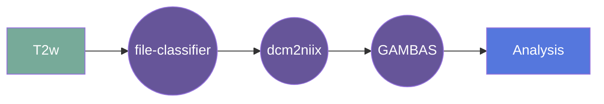

# iBEAT
### 

## Overview

[Usage](#usage)

[FAQ](#faq)

### Summary
iBEAT V2.0 is a toolbox for processing pediatric brain MR images, using multimodality (including T1w and T2w) or single-modality. The software is developed by the Developing Brain Computing Lab, and the Brain Research through Analysis and Informatics of Neuroimaging (BRAIN) Lab in the University of North Carolina at Chapel Hill. iBEAT was first developed in 2012 (led by Dr. Dinggang Shen), now re-developed with more advanced techniques (led by Dr. Li Wang and Dr. Gang Li). 

**license:**

**url:** <https://github.com/UNITY-Physics/fw-ibeat>

### Classification

*Category:* analysis

*Gear Level:*

* [x] Project
* [x] Subject
* [x] Session
* [ ] Acquisition
* [ ] Analysis

----

### Inputs

* api-key
  * **Name**: api-key
  * **Type**: object
  * **Optional**: true
  * **Classification**: api-key
  * **Description**: Flywheel API key.

### Config

* input
  * **Base**: file
  * **Description**: input file (axial or isotropic reconstruction)
  * **Optional**: false

### Outputs
* output
  * **Base**: file
  * **Description**: super resolved image
  * **Optional**: false

#### Metadata

No metadata currently created by this gear

### Pre-requisites

- Axial/Isotropic nifti file

#### Prerequisite Gear Runs

This gear runs on BIDS-organized data. To have your data BIDS-ified, it is recommended
that you run, in the following order:

1. ***dcm2niix***
    * Level: Any
2. ***file-metadata-importer***
    * Level: Any
3. ***file-classifier***
    * Level: Any

#### Prerequisite

## Usage

This section provides a more detailed description of the gear, including not just WHAT
it does, but HOW it works in flywheel

### Description

This gear is run at the `Session` level. It downloads the data for that subject/session and then runs the `gambas` module on it. Future development will include the ability to batch process multiple subjects/sessions from running the gear at the `Project` level.
After the pipeline is run, the output saved into the analysis
container.

#### File Specifications

#### GPU Usage
The default configuration for this gear is to use a CPU. This will perform super-resolution with a residual convolutiona neural network (RCNN). GPU can be enabled by setting the `tag` to `gpu` in the gear configuration. This will perform super-resolution with a 3D U-Net. Performance will be faster and the output will be of higher quality. 

### Workflow

A picture and description of the workflow

Description of workflow

1. Upload data to container
2. Prepare data by running the following gears:
   1. file classifier
   2. dcm2niix
3. Run the iBEAT gear
4. Output data is saved in the container

### Use Cases
- Super-resolution of ultra-low-field peadiatric MRI data

# How to Cite?
Please cite the following papers if you use the results provided by the iBEAT V2.0 pipeline:
* L. Wang, Z. Wu, L. Chen, Y. Sun, W. Lin, G. Li, "[iBEAT V2. 0: a multisite-applicable, deep learning-based pipeline for infant cerebral cortical surface reconstruction](10.1038/s41596-023-00806-x)," Nature Protocol, vol. 18(5), 2023, pp. 1488-1509. 
* L. Wang, G. Li, F. Shi, X. Cao, C. Lian, D. Nie, et al., "[Volume-based analysis of 6-month-old infant brain MRI for autism biomarker identification and early diagnosis](https://pubmed.ncbi.nlm.nih.gov/30430147/)," in International Conference on Medical Image Computing and Computer-Assisted Intervention, 2018, pp. 411-419.
* G. Li, J. Nie, L. Wang, F. Shi, J. H. Gilmore, W. Lin, et al., "[Measuring the dynamic longitudinal cortex development in infants by reconstruction of temporally consistent cortical surfaces](https://pubmed.ncbi.nlm.nih.gov/24374075/)," Neuroimage, vol. 90, pp. 266-279, 2014.
* G. Li, L. Wang, P.-T. Yap, F. Wang, Z. Wu, Y. Meng, et al., "[Computational neuroanatomy of baby brains: A review](https://pubmed.ncbi.nlm.nih.gov/29574033/)," NeuroImage, vol. 185, pp. 906-925, 2018.
* G. Li, L. Wang, F. Shi, J. Gilmore, W. Lin, D. Shen, "[Construction of 4D high-definition cortical surface atlases of infants: Methods and applications](https://pubmed.ncbi.nlm.nih.gov/25980388/)," Medical Image Analysis, 25: 22-36, 2015.

# Contacts
The iBEAT V2.0 software is developed by the University of North Carolina at Chapel Hill:
* Volume-based analysis was designed in the Developing Brain Computing Lab, led by Dr. Li Wang (li_wang@med.unc.edu);
* Surface-based analysis was designed in the Brain Research through Analysis and Informatics of Neuroimaging (BRAIN) Lab, led by Dr. Gang Li (gang_li@med.unc.edu).

For questions/bugs/feedback, please contact:

Zhengwang Wu, Ph.D.,  zhwwu@med.unc.edu\
Li Wang, Ph.D.,  li_wang@med.unc.edu\
Gang Li, Ph.D.,  gang_li@med.unc.edu\
Department of Radiology and Biomedical Research Imaging Center\
The University of North Carolina at Chapel Hill

## FAQ

[FAQ.md](FAQ.md)

## Contributing

[For more information about how to get started contributing to that gear,
checkout [CONTRIBUTING.md](CONTRIBUTING.md).]
# fw-ibeat
